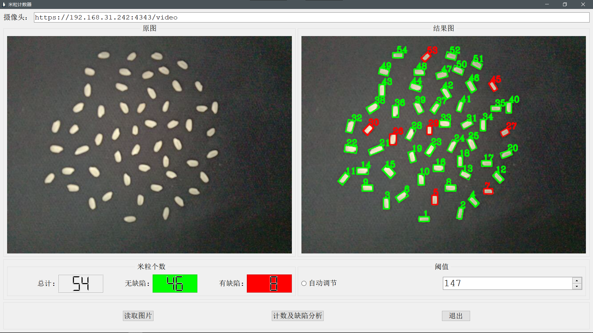

# 开发编译工具
程序语言选用 C++。编写程序选用了 QT Creator，界面开发工具选用了 QT Designer，Visual Studio Code 用来验证算法。构建程序选用了qmake。图像处理库选用开源的 Opencv3.4.14
# 软件功能
利用身边摄像头、手机等摄像器材，设计一个视觉检测系统，实现米粒的计数、缺陷分析功能。编写计数函数实现目标计数；编写目标分析函数实现目标的缺陷分类；利用 C++结合 OpenCV 编写程序实现点击按钮后读取图像、调用计数函数、调用目标分析函数实现计数及分类输出、将结果显示在用户界面上。
# 效果
